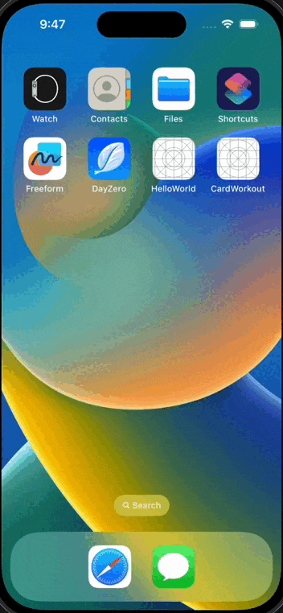
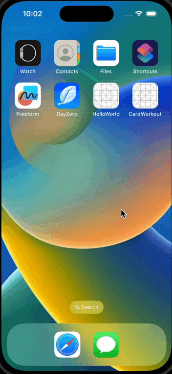
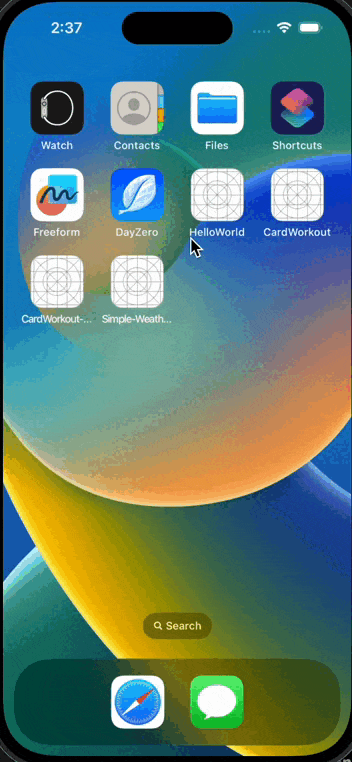
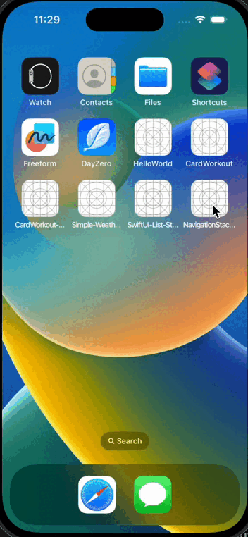

# iOS-Dev

iOS Development

 

| App 1 | App 2 | App 3 |
| -- | -- | -- |
|  |  |   |
| StoryBoard + UIKit | StoryBoard + UIKit + ViewController + Segue | UIKit + Programmatic UI |

 

| App 4 | App 5 | App 6 |
| -- | -- | -- |
|  |  |  |
| SwiftUI + State Bindings | SwiftUI + List + Navigation  | NavigationStack + NavigationPath |

---